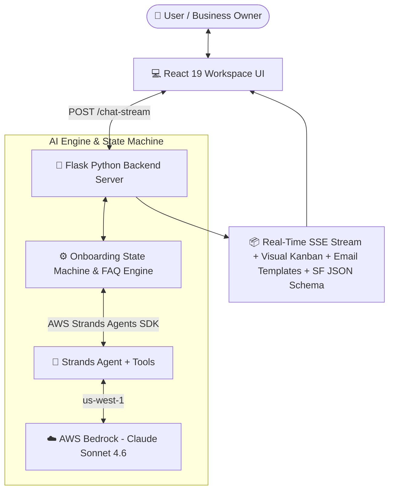

# 🤖 NextWave CRM Onboarding Agent

> **Agents for Humans Hackathon 2026 — Professional Agents Track**  
> An autonomous AI Agent workspace that helps small businesses and nonprofits configure Salesforce CRM automatically using **AWS Strands Agents SDK** and **Claude AI via Amazon Bedrock**.

---

## 🎯 The Problem

Small businesses and non-profits waste weeks (and thousands of dollars) trying to figure out how to configure Salesforce CRM. At **NextWave Tech Studio**, we manually coordinate CRM onboarding for clients every day — this agent automates that entire discovery and planning process in minutes.

---

## ✅ The Solution

A conversational AI Agent workspace that guides non-technical users through 5 key business questions and instantly generates:
1. **Custom Salesforce Sales Pipeline** (industry-tailored stages).
2. **Interactive Visual Kanban Board** preview of their pipeline.
3. **Automations & Custom Fields Schema** (downloadable JSON for Salesforce setup).
4. **Custom Sales Outreach & Follow-up Email Templates**.
5. **1-Click Export Package** (`.md` plan and `.json` schema).

---

## 🏗 System Architecture



---

## ⚡ Advanced AWS Strands SDK Architecture

1. 🤖 **Multi-Agent Supervisor Pattern ([`supervisor_agent.py`](file:///c:/Users/ruby4/crm-onboarding-agent/supervisor_agent.py))**:
   - Uses a Supervisor Router Agent to orchestrate 3 specialized sub-agents: **Onboarding Agent**, **Billing Agent**, and **Technical Support Agent**.

2. 🔧 **Agent Lifecycle Hooks (`CRMAgentHooks`)**:
   - Implements event hooks (`on_tool_start`, `on_tool_end`, `on_llm_start`) for real-time Agent execution monitoring and logging.

3. 🌐 **Live Web Search & Execution Tools ([`tools.py`](file:///c:/Users/ruby4/crm-onboarding-agent/tools.py))**:
   - Equips agents with custom `@tool` functions: `generate_crm_plan`, `send_welcome_email`, `calculate_crm_cost`, `check_subscription_status`, `cancel_subscription`, and `search_salesforce_pricing`.

4. 🧠 **Memory & Conversation Persistence**:
   - Natively uses `SlidingWindowConversationManager(window_size=10)` to preserve multi-turn agent conversation context.

---

## ✨ Key Features

- ⚡ **Real Autonomous Agent Task Execution**: 1-click `⚡ Execute Agent Workflows & Tasks` button triggers the `/run-agent-tasks` API endpoint to execute and configure custom Salesforce pipelines, AI email suites, automation rules, and welcome packages step-by-step in real-time.
- 🤖 **Autonomous Auto-Demo Mode**: 1-click `▶️ Watch Agent Work Automatically` button runs the complete onboarding lifecycle autonomously without manual user typing.
- 🎯 **5-Question Guided Onboarding**: Asks key business questions (industry, team size, lead sources, sales journey, follow-up style).
- 📊 **Visual Kanban Stage Pipeline**: Renders live stage cards directly inside the workspace UI.
- 📧 **AI Sales Email Generator**: Produces ready-to-use outreach and follow-up email templates.
- ⚙️ **Salesforce Schema Exporter**: Generates a `.json` schema file formatted for Salesforce Data Loader/API import.
- 🧠 **Smart Intent Guard & Fallback**: Handles off-topic queries gracefully with Claude AI while keeping onboarding state on track.
- ⚡ **Quick Suggestion Chips**: Clickable prompt pills for single-tap answering.

---

## 💼 Real-World Impact & Case Studies

Built from real-world consulting experience coordinating Salesforce CRM for:
- 🏦 **Quantum Leap Wealth** — Financial services firm
- 🌿 **Open Space STL** — Nonprofit environmental organization
- 🛸 **Drone Girlz** — STEM & Nonprofit organization

---

## 🛠 Tech Stack

- **AI Engine**: AWS Strands Agents SDK (`strands`)
- **LLM / Infrastructure**: Amazon Bedrock (`global.anthropic.claude-sonnet-4-6`)
- **Backend**: Python 3, Flask, Flask-CORS
- **Frontend**: React 19, Vanilla CSS3 (Custom Dark Mode UI)
- **CRM Target**: Salesforce Sales Cloud

---

## 🚀 How to Run Locally

### 1. Clone & Install Dependencies

```bash
git clone https://github.com/Rubygupta04/crm-onboarding-agent.git
cd crm-onboarding-agent
```

### 2. Run Python Backend Server

```bash
pip install flask flask-cors strands-agents strands-agents-tools
python app.py
```
*Backend runs on `http://localhost:5000`*

### 3. Run React Frontend UI

```bash
cd crm-agent-ui
npm install
npm start
```
*Frontend opens at `http://localhost:3000`*

### 4. Run Multi-Agent Supervisor System (Optional)

```bash
python supervisor_agent.py
```

---

## 👩‍💻 Built By

**Ruby Gupta** — NextWave Tech Studio  
🌐 [dnextwave.com](https://dnextwave.com)
