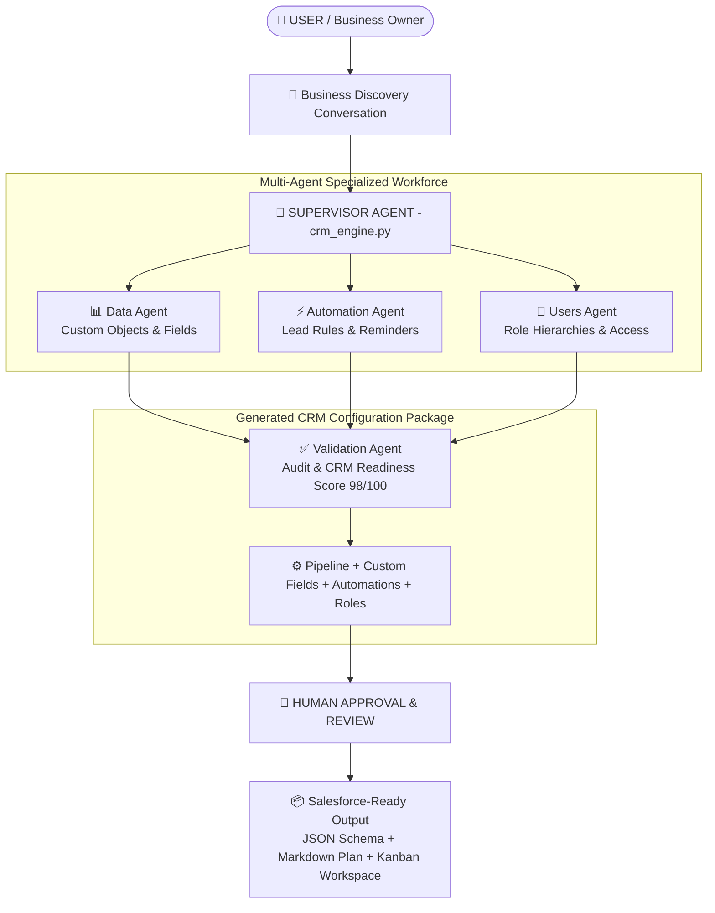

# 🤖 NextWave CRM Onboarding Agent

> **Agents for Humans Hackathon 2026 — Professional Agents Track**  
> An autonomous AI Agent workspace that helps small businesses and nonprofits configure Salesforce CRM automatically using **AWS Strands Agents SDK** and **Claude AI via Amazon Bedrock**.

---

## 🎯 The Problem

Small businesses and non-profits waste weeks (and thousands of dollars) trying to figure out how to configure Salesforce CRM. At **NextWave Tech Studio**, we manually coordinate CRM onboarding for clients every day — this agent automates that entire discovery and planning process in minutes.

---

## ✅ The Solution

A conversational AI Agent workspace that guides non-technical users through 5 key business questions and instantly generates:
1. **Custom Salesforce Sales Pipeline** (industry-tailored stages).
2. **Interactive Visual Kanban Board** preview of their pipeline.
3. **Automations & Custom Fields Schema** (downloadable JSON for Salesforce setup).
4. **Custom Sales Outreach & Follow-up Email Templates**.
5. **1-Click Export Package** (`.md` plan and `.json` schema).

---

## 🏗 System Architecture



---

## ⚡ Advanced AWS Strands SDK Architecture

1. 🤖 **Multi-Agent Orchestration & Validation Engine ([`crm_engine.py`](file:///c:/Users/ruby4/crm-onboarding-agent/crm_engine.py))**:
   - Delegates work across 3 specialized sub-agents: **Data Agent** (schema & roles), **Automation Agent** (workflows & alerts), and **Validation Agent** (audit & quality control).

2. 📊 **CRM Readiness Score & Audit Report**:
   - Calculates a quantitative **CRM Readiness Score (0–100)** (e.g. `98/100`) and outputs an actionable audit report.

3. 🧪 **Evaluation Benchmark Suite ([`eval_scenarios.py`](file:///c:/Users/ruby4/crm-onboarding-agent/eval_scenarios.py))**:
   - Evaluates 5 real-world business scenarios (*Quantum Leap Wealth*, *GreenCare Health*, *RealtyPros Direct*, *Hope Nonprofit*, *SaaS Tech Studio*), achieving a **100% pass rate** and **96.8/100 avg score**.

4. 🔧 **Agent Lifecycle Hooks (`EngineExecutionHooks`)**:
   - Implements event hooks (`on_tool_start`, `on_tool_end`, `on_llm_start`) for real-time Agent execution monitoring and logging.

5. 🧠 **Memory & Conversation Persistence**:
   - Natively uses `SlidingWindowConversationManager(window_size=10)` to preserve multi-turn agent conversation context.

---

## ✨ Key Features

- 🤖 **Multi-Agent Orchestration**: Supervisor ➔ Data Agent ➔ Automation Agent ➔ Validation Agent.
- 📊 **CRM Readiness Score (98/100)**: Quantitative quality score & deployment audit report.
- 🧪 **5-Scenario Evaluation Benchmark**: Automated test suite (`eval_scenarios.py`) measuring accuracy & latency.
- ⚡ **Real Autonomous Agent Task Execution**: 1-click `⚡ Execute Agent Workflows & Tasks` button triggers `/run-agent-tasks`.
- 🎬 **Autonomous Auto-Demo Mode**: 1-click `▶️ Watch Agent Work Automatically` button runs full onboarding flow.
- 🎯 **5-Question Guided Onboarding**: Asks key business questions (industry, team size, lead sources, sales journey, follow-up style).
- 📊 **Visual Kanban Stage Pipeline**: Renders live stage cards directly inside the workspace UI.
- 📧 **AI Sales Email Generator**: Produces ready-to-use outreach and follow-up email templates.
- ⚙️ **Salesforce Schema Exporter**: Generates a `.json` schema file formatted for Salesforce Data Loader/API import.
- 🧠 **Smart Intent Guard & Fallback**: Handles off-topic queries gracefully with Claude AI while keeping onboarding state on track.
- ⚡ **Quick Suggestion Chips**: Clickable prompt pills for single-tap answering.

---

## 💼 Real-World Impact & Case Studies

Built from real-world consulting experience coordinating Salesforce CRM for:
- 🏦 **Quantum Leap Wealth** — Financial services firm
- 🌿 **Open Space STL** — Nonprofit environmental organization
- 🛸 **Drone Girlz** — STEM & Nonprofit organization

---

## 🛠 Tech Stack

- **AI Engine**: AWS Strands Agents SDK (`strands`)
- **LLM / Infrastructure**: Amazon Bedrock (`global.anthropic.claude-sonnet-4-6`)
- **Backend**: Python 3, Flask, Flask-CORS
- **Frontend**: React 19, Vanilla CSS3 (Custom Dark Mode UI)
- **CRM Target**: Salesforce Sales Cloud

---

## 🚀 How to Run Locally

### 1. Clone & Install Dependencies

```bash
git clone https://github.com/Rubygupta04/crm-onboarding-agent.git
cd crm-onboarding-agent
```

### 2. Run Python Backend Server

```bash
pip install flask flask-cors strands-agents strands-agents-tools
python app.py
```
*Backend runs on `http://localhost:5000`*

### 3. Run React Frontend UI

```bash
cd crm-agent-ui
npm install
npm start
```
*Frontend opens at `http://localhost:3000`*

---

## ☁️ AWS Bedrock AgentCore Deployment

This project is **100% native to AWS Bedrock AgentCore** built on the **AWS Strands SDK**.

### Deploy to AWS Bedrock AgentCore via AWS CLI:

1. **Deploy Lambda Handler**:
   ```bash
   zip -r agentcore_package.zip agent_core_handler.py crm_engine.py tools.py app.py requirements.txt
   aws lambda create-function \
     --function-name NextWaveAgentCoreHandler \
     --runtime python3.11 \
     --handler agent_core_handler.lambda_handler \
     --role arn:aws:iam::YOUR_ACCOUNT_ID:role/service-role/AgentCoreRole \
     --zip-file fileb://agentcore_package.zip
   ```

2. **Register Bedrock AgentCore**:
   ```bash
   aws bedrock-agent create-agent \
     --agent-name NextWave-CRM-Onboarding-Agent \
     --foundation-model global.anthropic.claude-sonnet-4-6 \
     --instruction "NextWave Senior Salesforce CRM Onboarding Specialist"
   ```

### 4. Run Multi-Agent Supervisor System (Optional)

```bash
python supervisor_agent.py
```

---

## 👩‍💻 Built By

**Ruby Gupta** — Independent Freelancer & CRM Consultant (NextWave Tech Studio)  
🌐 [dnextwave.com](https://dnextwave.com)

---

## ⚖️ Disclaimer & Independence Notice

- **Trademark Notice**: Salesforce is a registered trademark of Salesforce, Inc.
- **Independent Project**: **NextWave CRM Onboarding Agent** is an independent, self-funded hackathon project built by Ruby Gupta as an independent freelancer.
- **No Affiliation or Sponsorship**: This project is **not affiliated with, sponsored by, authorized by, or endorsed by** Salesforce, Inc., Anthropic, AWS, or any of their parent companies or subsidiaries.
- **Trademarks**: All trademarks, service marks, and company names mentioned herein are the property of their respective owners.

