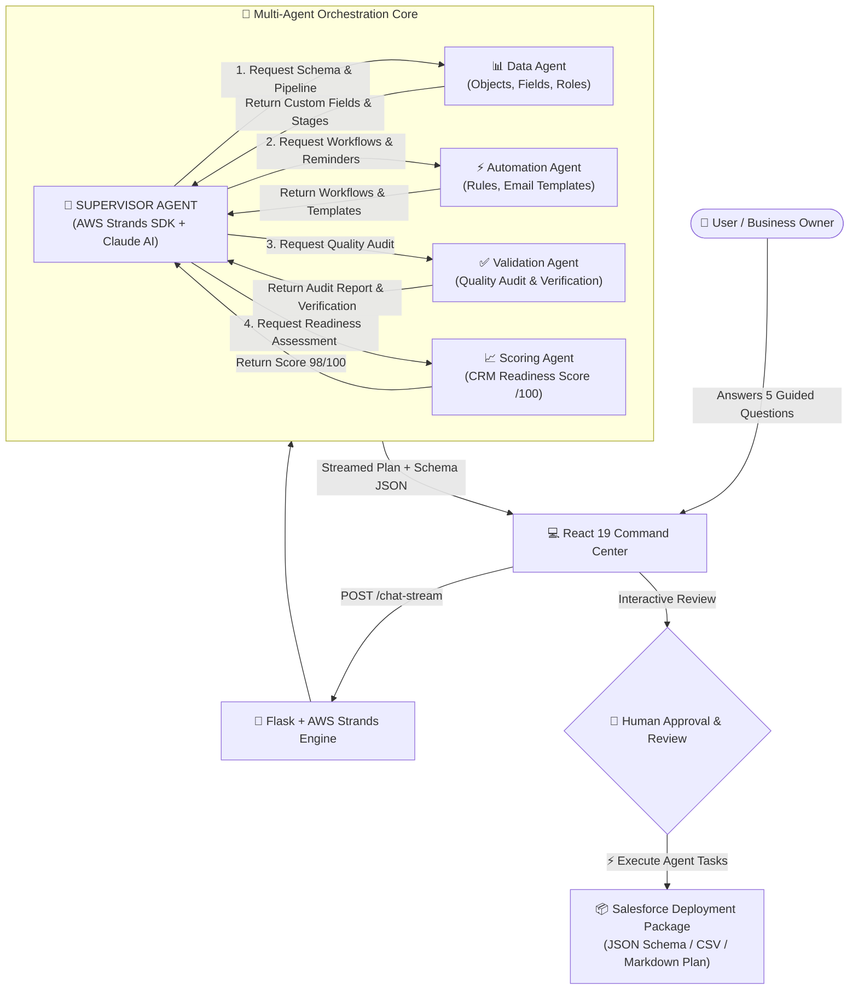
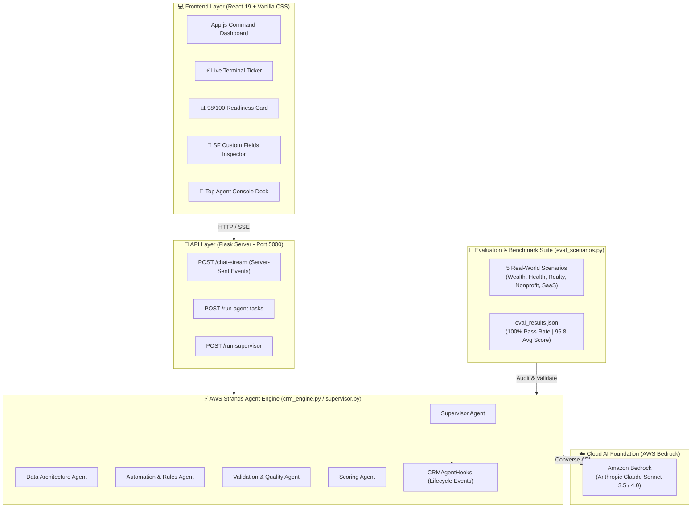
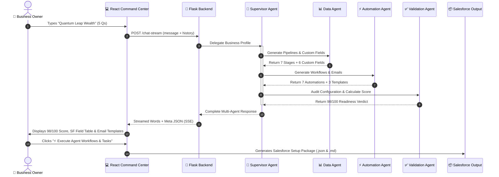

# 📊 Architecture & Workflow Diagrams

## NextWave Autonomous CRM Onboarding Platform
**Agents for Humans Hackathon 2026 Presentation Package**

---

## 1. Multi-Agent Orchestration Flowchart

This diagram illustrates how the **Supervisor Agent** coordinates work between specialized sub-agents and produces validated Salesforce configurations with human oversight.

---

## 2. System Architecture Diagram

This diagram shows the complete full-stack architecture of the platform, from the front-end dashboard down to AWS Bedrock and evaluation benchmarks.

---

## 3. Data Flow & Transformation Sequence

---

## 4. Evaluation Benchmark Suite Overview

```mermaid
gantt
    title 🧪 Evaluation Benchmark Suite Results (100% Pass Rate)
    dateFormat  X
    axisFormat %s

    section Scenarios Tested
    Quantum Leap Wealth (Financial)  :active, q1, 0, 98
    GreenCare Health (Healthcare)     :active, q2, 0, 96
    RealtyPros Direct (Real Estate)  :active, q3, 0, 97
    Hope Foundation (Nonprofit)      :active, q4, 0, 95
    SaaS Tech Studio (Technology)    :active, q5, 0, 98
```

---

## 💡 How to Use These Diagrams in Your Hackathon Presentation

1. **For Devpost / GitHub README**: Copy the Mermaid code blocks directly into your markdown — Devpost and GitHub render Mermaid natively!
2. **For Slide Deck / Presentation**: Take a screenshot of these diagrams or copy the text structure into Google Slides / PowerPoint.
3. **During Pitch**:
   - Show Diagram #1 when explaining **"Why Multi-Agent?"**
   - Show Diagram #2 when judges ask **"What tech stack did you use?"**
   - Show Diagram #4 when judges ask **"Did you test it on real scenarios?"**
